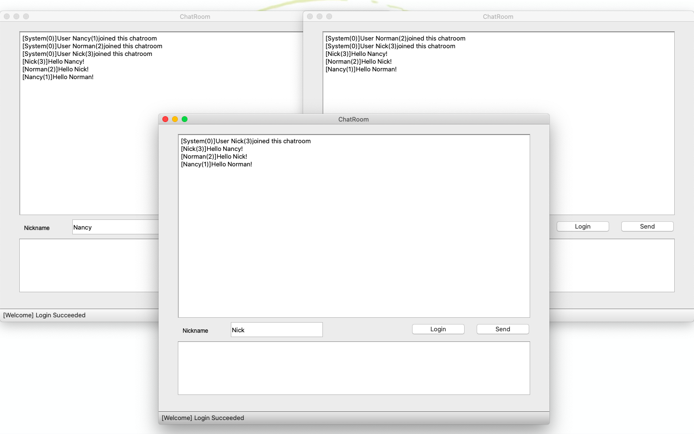
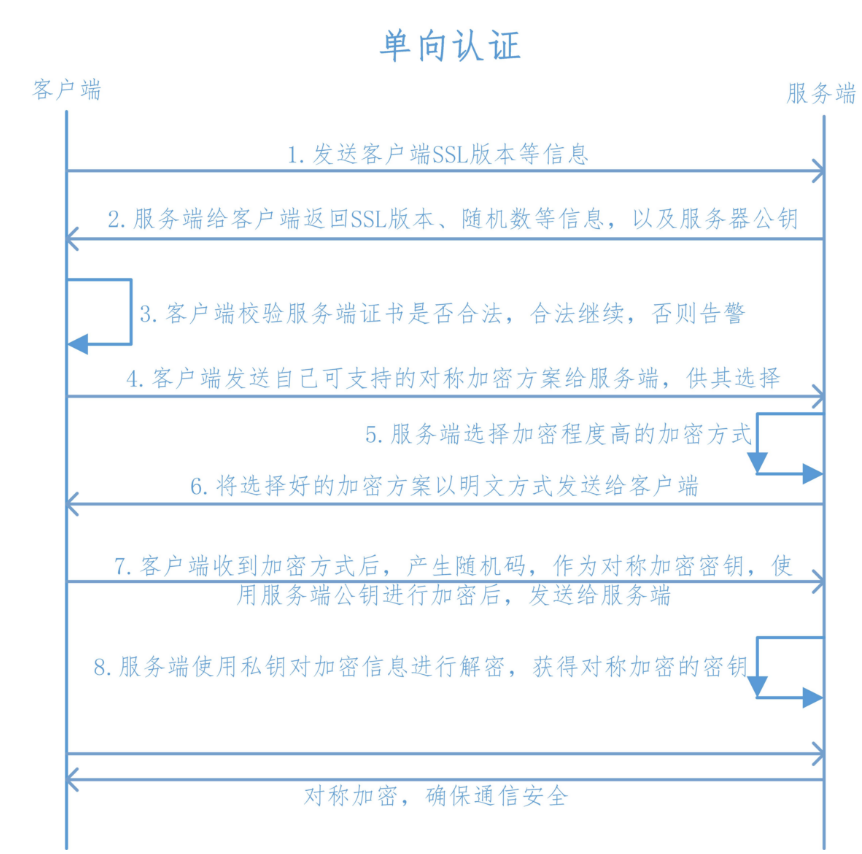

<h3 style="text-align:center;font-size:200%;" >基于Python中Socket库的聊天室应用</h3>

#### 内容简介

本系统是基于Python中socket底层网络库开发的聊天室服务端和客户端，可以实现TLS加密传输的群组聊天。

#### 开发环境

* 操作系统: MacOS 10.15.1
* 编程语言: Python 3.8.0 64-bit 
* 图形界面库: PyQt5 5.13.2
* 证书生成: OpenSSL 1.1.1d

#### 文件说明

```shell
.
├── ca_gen.sh 										# 证书生成脚本
│  
├── client 												## 客户端
│   ├── server.crt								# 证书
│   ├── client.py 								# 客户端主程序
│   ├── network.py 								# 网络接口 
│   └── view.py										# 图形接口
│  
└── server												## 服务端
    ├── server.crt								# 证书
    ├── server.key								# 证书密钥
    └── server.py									# 服务器主程序
```

#### 运行方式



* 本系统服务端只需要在服务器运行`python server.py`，并确保相应端口（默认为8888端口）打开即可。

* 本系统客户端需要首先在`client.py`中连接的IP地址和端口（默认为本机8888端口），然后运行`python client.py`。
* 本系统客户端图形界面`Nickname`框中可以输入自己的昵称，然后点击`Login`按钮就可以连接到服务器。在下方的文本框内输入聊天语句之后点击`Send`按钮，就可以发送到聊天室内。

#### 设计思路


本系统遵循MVC(Model-View-Controller)设计架构，MVC 模式的基本思想是数据，显示和处理相分离。模型(Model)负责数据管理，视图(View)负责数据显示，控制器(Controller)负责业务逻辑和响应策略。

在客户端的实现中，本系统可以分为`Client_View`，`Client_Network`和`Client`三部分，分别实现用户交互，网络交互和流程控制。借助于Qt的信号与槽机制，我们可以将网络信号和用户信号都集中到`Client`控制器，然后调用双方进行响应。

#### 收发实现

socket库为我们提供了可靠的TCP数据连接接口，客户端中我们只需要连接到服务器之后就可以直接调用`send`和`recv`函数进行收发，比如登录操作就是在客户端就是发送带有`login`头部的消息，用`json`格式传输字符串。在服务器端我们接受消息后，进行`json`解析，并根据类型不同分别进行反应。

```python
self.__ssocket.send(json.dumps({
    'type': 'login',
    'nickname': nickname
}).encode())


buffer = connection.recv(1024).decode()
obj = json.loads(buffer)
if obj['type'] == 'login':
    self.__connections.append(connection)
    self.__nicknames.append(obj['nickname'])
    connection.send(json.dumps({
        'id': len(self.__connections) - 1
    }).encode())
```

我们只实现了最简单的匿名聊天室应用，每个用户的登录不需要经过与数据库比对，每个用户的信息会广播到聊天室内所有的用户。我们对客户端发送的也是经过`json`格式转换后的词典结构，这里我们只发送一种消息。

```python
def __broadcast(self, user_id=0, message=''):
    for i in range(1, len(self.__connections)):
        if user_id != i and self.__connections[i]:
            self.__connections[i].send(json.dumps({
                'sender_id': user_id,
                'sender_nickname': self.__nicknames[user_id],
                'message': message
            }).encode())
```

#### 多线程实现

Python自带的thread库为我们提功了简单的线程创建接口，服务端里我们可以使用`list`管理所有的线程，使用多线程可以把占据长时间的程序中的任务放到后台去处理。

比如，客户端接收消息线程就可以单列一个线程进行执行，以实现实时消息接收。

```python
def __receive_message_thread(self):
    while True:
        try:
            buffer = self.__ssocket.recv(1024).decode()
            obj = json.loads(buffer)
            self.msg.emit('[' + str(obj['sender_nickname']) + '(' + str(obj['sender_id']) + ')' + ']' + obj['message'])
        except Exception:
            self.stat.emit('[Error] Failed to fetch data from server.')
            self.__conn_flag = False
            return
        time.sleep(1)     
```

更重要的是，服务器端需要接受多个连接，就必须要为每一个连接都进行服务，使用多线程以及线程管理就能够让多个用户能够同时聊天。

```python
def __user_thread(self, user_id):
    connection = self.__connections[user_id]
    nickname = self.__nicknames[user_id]
    print('[Server] User', user_id, nickname, 'joined this chatroom')
    self.__broadcast(message='User ' + str(nickname) + '(' + str(user_id) + ')' + 'joined this chatroom')
    while True:
        try:
            buffer = connection.recv(1024).decode()
            obj = json.loads(buffer)
            if obj['type'] == 'broadcast':
                self.__broadcast(obj['sender_id'], obj['message'])
            else:
                print('[Server] Failed to parse json:', connection.getsockname(), connection.fileno())
        except Exception:
            print('[Server] Connection failed:', connection.getsockname(), connection.fileno())
            self.__broadcast(message='User ' + str(nickname) + '(' + str(user_id) + ')' + 'exited the chatroom')
            self.__connections[user_id].close()
            self.__connections[user_id] = None
            self.__nicknames[user_id] = None
            return
        time.sleep(0.1)
```

#### 加密实现

ssl库为我们提供了简单易用的加密传输协议，可以配合socket库进行简单包装，就可以进行TLS连接，其中我们用到的签名证书可以用openssl软件进行生成。这里我们使用的是最新的TLSv1.2协议，进行仅在客户端进行单向验证。



我们可以生成服务器证书并进行最简单的自签名。

```shell
# generate SERVER CSR
openssl req -newkey rsa:2048 -nodes -keyout server.key  -out server.csr -subj "/C=CN/ST=SH/L=SH/O=FDU/OU=CS/CN=SERVER/emailAddress=312013477@qq.com"
# sign CSR 2 CRT
openssl x509 -req -days 365 -in server.csr -signkey server.key -out server.crt
```

对于客户端，我们创建加密上下文，并且加载刚才生成的证书，接着对`socket`进行打包。

```python
self.__context = ssl.SSLContext(ssl.PROTOCOL_TLSv1_2)
self.__context.load_verify_locations(os.path.join('sever.crt'))
self.__ssocket = self.__context.wrap_socket(self.__socket, server_hostname='SERVER')
```

对于服务端，我们创建加密上下文后需要加载服务器证书和私钥，最后也进行打包。

```python
self.__context = ssl.SSLContext(ssl.PROTOCOL_TLSv1_2)
self.__context.load_cert_chain(os.path.join('server.crt'), os.path.join('server.key'))
self.__ssocket = self.__context.wrap_socket(self.__socket, server_side=True)
```

#### 特色创新

* 可扩展头部设计：本系统使用了json数据结构，每个数据包都有一个头部指示数据类型，我们可以根据这个头部选择我们的响应。而且，这个头部可以扩展并包含多种数据类型。
* 支持用户重复登录：用户可以在连接断开，更换用户名或其他需要重新登录的情况下点击`login`按钮，用户可以随时更换自己的昵称。
* 方便的状态栏提示：客户端网络状态可以方便地在窗口下端状态栏看见，用户可以根据状态栏的提示进行重新连接。

#### 项目总结

本项目实现了基于Python中socket底层网络库开发的聊天室服务端和客户端，使用PyQt作为图形界面，并在socket之上使用TLS进行加密传输。聊天室支持多人同时在线群聊，用户无需验证，可以随时更换自己昵称。软件架构采用MVC架构，功能扩展性强，调试修改方便。

通过项目实战，熟悉了TCP传输层之上应用层的程序编写，并尝试使用了证书链来对TCP连接进行加密，强化了对于网络层和应用层的理解。
